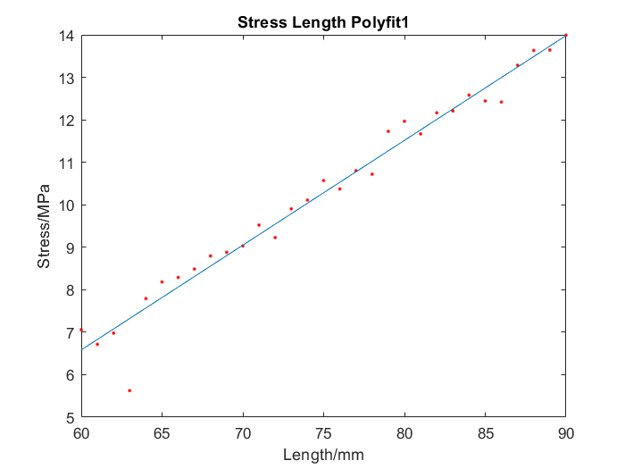

# Subsystem 1: payload loading optimisation
## List of documents
### MATLAB code
  1. [stress_armlength.m](stress_armlength.m)
  2. [stress_armwidth_armthickness.m](stress_armwidth_armthickness.m)
  3. [subsystem1_optimisation.m](subsystem1_optimisation.m)
### Datasets
  1. [rual.csv](rual.csv)
  2. [ruall.csv](ruall.csv)
## MATLAB add-on needed
  1. curve fitting toolbox
  2. optimization toolbox
## Instruction
### 1. Arm length partial minimization
Open stress_armlenght.m and run the code in matlab. The code reads the data in rual.csv and will plot a graph of drone arm length against maximum stress.

This indicated the linear relationship between drone arm length and maximum stress. The dimensional lower bound for arm length was 81.6mm, so the arm length was minimized to 81.6mm.
