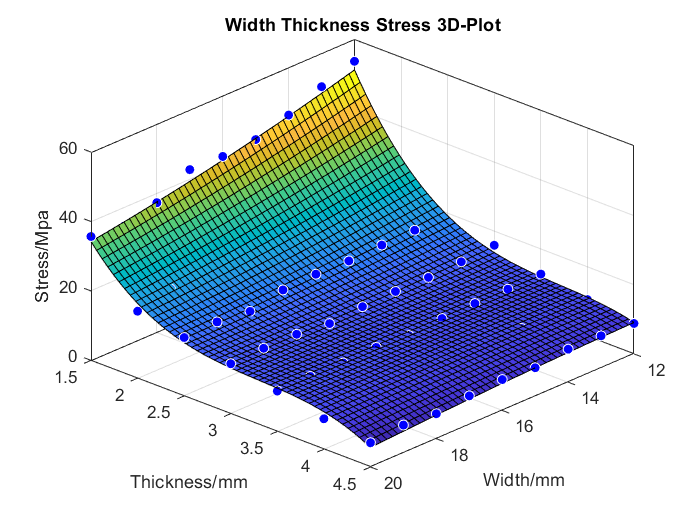
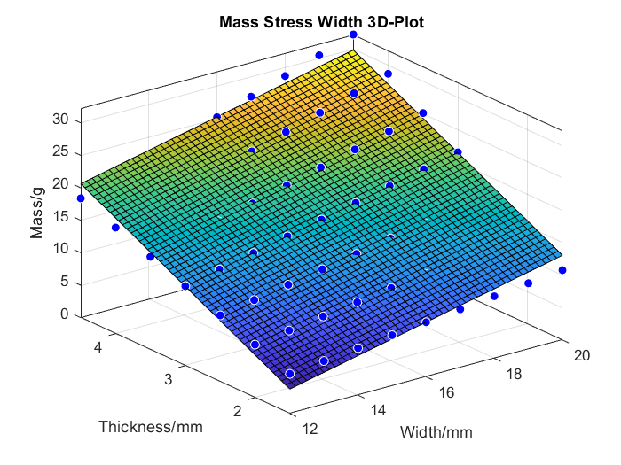
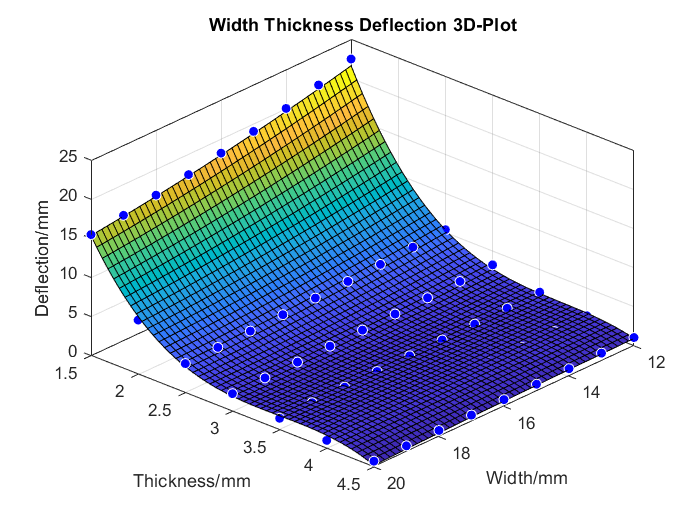
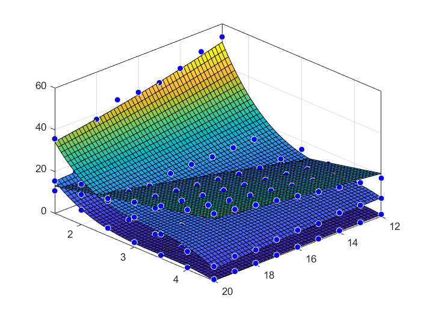

# Subsystem 1: payload loading optimisation
## List of documents
### MATLAB code
  1. [stress_armlength.m](stress_armlength.m)
  2. [stress_armwidth_armthickness.m](stress_armwidth_armthickness.m)
  3. [subsystem1_optimisation.m](subsystem1_optimisation.m)
### Datasets
  1. [rual.csv](rual.csv)
  2. [ruall.csv](ruall.csv)
## MATLAB add-on needed
  1. [curve fitting toolbox](https://uk.mathworks.com/products/curvefitting.html)
  2. [optimization toolbox](https://uk.mathworks.com/products/optimization.html)
## Instruction
### 1. Arm length partial minimization
Open [stress_armlength.m](stress_armlength.m) and run the code in MATLAB(Elapsed time is 0.082109 seconds). The code reads the data in [rual.csv](rual.csv) and will plot a graph of drone arm length against maximum stress.

This indicated the linear relationship between drone arm length and maximum stress. The dimensional lower bound for arm length was 81.6mm, so the arm length was minimized to 81.6mm.
### 2. Objective function with variables of arm width and thickness 
Open [stress_armwidth_armthickness.m](stress_armwidth_armthickness.m) and run the code in MATLAB(Elapsed time is 0.408325 seconds). The code reads the data in [ruall.csv](ruall.csv) and use curve fitting toolbox to generate functions subject to drone arm width and thickness.

The objective function was generated with arm width and thickness against maximum stress using polynomial fit, degree 2 and 3. The surface plot showed a surface curve.

     fs(x,y) = p00 + p10*x + p01*y + p20*x^2 + p11*x*y + p02*y^2 + p21*x^2*y 
                    + p12*x*y^2 + p03*y^3
                    
     Coefficients (with 95% confidence bounds):
       p00 =       299.1  (231.2, 367.1)
       p10 =      -10.87  (-18.82, -2.919)
       p01 =      -193.4  (-225.3, -161.4)
       p20 =      0.1366  (-0.1062, 0.3794)
       p11 =       4.904  (2.163, 7.646)
       p02 =       43.54  (36.87, 50.21)
       p21 =    -0.03705  (-0.1138, 0.03973)
       p12 =     -0.5268  (-0.7276, -0.3259)
       p03 =      -3.334  (-3.98, -2.687)

Nonlinear constraint of the mass of drone frame was fitted to a function using polynomial fit, degree 1 and 1.

Nonlinear constraint of the deflection on drone arm was also fitted to a function using polynomial fit, degree 2 and 3.

Plotting the objective function with constraint functions, it showed that the deflection was not constraining the objective function in this variable range. The mass, however, constrained the objective function at the intersection of two surfaces.

### 3. Optimisation
Open [subsystem1_optimisation.m](subsystem1_optimisation.m) and run the code in MATLAB(Elapsed time is 0.437070 seconds).The optimisation method used for this objective function was nonlinear constrained optimisation. A local minimum was found at the upper bounds of the variable ranges, where width = 20mm and thickness = 4.5mm.

    Local minimum found that satisfies the constraints.

    Optimization completed because the objective function is non-decreasing in 
    feasible directions, to within the default value of the optimality tolerance,
    and constraints are satisfied to within the default value of the constraint tolerance.

    <stopping criteria details>

    x =

       20.0000    4.5000

