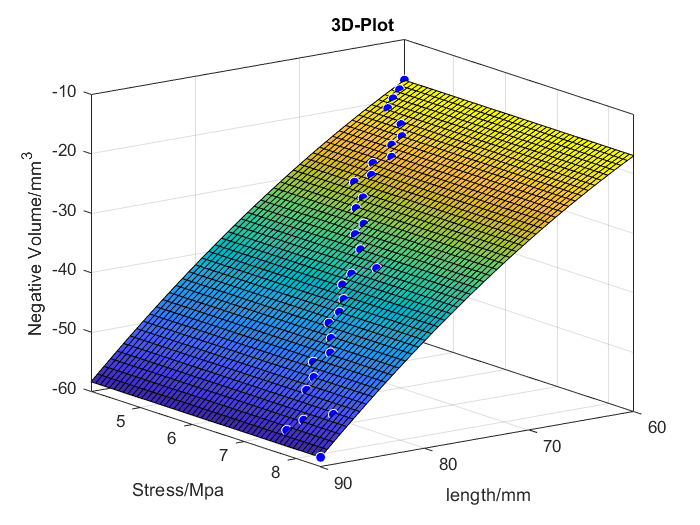

# System level optimisation 
## list of documents
### MATLAB code
  - [system_lvl_optimisation.m](system_lvl_optimisation.m)
### Dataset
  - [ruarua.csv](ruarua.csv)
### MATLAB add-on needed
  - [curve fitting toolbox](https://uk.mathworks.com/products/curvefitting.html)
  - [optimization toolbox](https://uk.mathworks.com/products/optimization.html)
## Instruction
**NOTE:** execution time are recorded with Windows 10 Pro system setup running Intel(R)Core(TM)i7-4710MQ CPU @ 2.50GHz.
### 1. Overall objective of system level optimisation
The system level objective was to **maximise** the **volume** of the object carried, with drone arm width and thickness optimized in subsystem 1, the maximum stress on drone arms could act as a variable indicating the load of objective volume that the drone could carry. 

The dataset was generated from FEA simulation with optimized arm width and thickness, the maximum volume data was generated using the algorithm defined in subsystem 2.
### 2. Objective function and optimisation
Open [system_lvl_optimisation.m](system_lvl_optimisation.m) and run the code in MATLAB(Elapsed time is 0.144628 seconds). The code reads the data in ruarua.csv and use curve fitting toolbox to generate functions subject to drone arm length and maximum allowed stress.

The objective function was generated with arm length and maximum allowed stress against minimum negative volume using polynomial fit, degree 2 and 2. The surface plot showed a surface curve.

     ff(x,y) = p00 + p10*x + p01*y + p20*x^2 + p11*x*y + p02*y^2
     Coefficients (with 95% confidence bounds):
       p00 =      -8.635  (-8.635, -8.635)
       p10 =      0.6908  (0.6908, 0.6908)
       p01 =   1.618e-13  (-6.832e-13, 1.007e-12)
       p20 =    -0.01382  (-0.01382, -0.01382)
       p11 =  -3.234e-15  (-3.118e-14, 2.471e-14)
       p02 =   6.588e-15  (-9.638e-14, 1.096e-13)

The optimisation method used for this objective function was nonlinear constrained optimisation. A local minimum was found at the upper bound of the the arm length range, where length = 90mm, maximum allowed stress = 5.8627 MPa

    Local minimum found that satisfies the constraints.

    Optimization completed because the objective function is non-decreasing in 
    feasible directions, to within the default value of the optimality tolerance,
    and constraints are satisfied to within the default value of the constraint tolerance.

    <stopping criteria details>

    x =

       90.0000    5.8627
  
